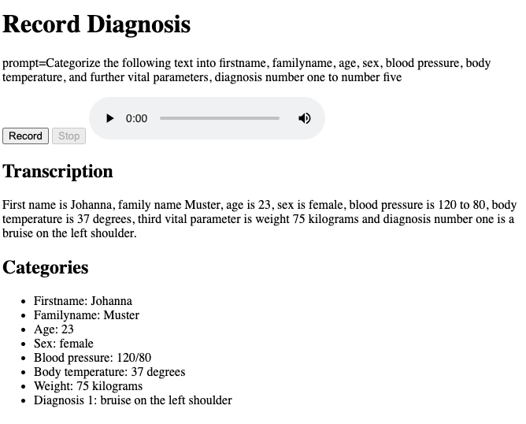

# Speech2Structure

## Prerequisites

- Python 3.8 or higher
- Flask
- OpenAI API key
- `pip` (Python package installer)
- Miniconda (optional, for creating a virtual environment)

## Install

1. Clone the repository:
    ```sh
    git clone https://github.com/yourusername/speech2structure.git
    cd speech2structure
    ```

2. Create and activate a virtual environment using Miniconda:
    ```sh
    conda create -n speech2structure python=3.8
    conda activate speech2structure
    ```

3. Install the required packages:
    ```sh
    pip install -r requirements.txt
    ```

4. Create a `.env` file in the project root and add your OpenAI API key:
    ```env
    OPENAI_API_KEY=your_openai_api_key
    ```

## Build

No build steps are required for this project.

## Run / Call in Web Browser

1. Start the Flask server:
    ```sh
    python app.py
    ```

2. Open your web browser and navigate to:
    ```
    http://127.0.0.1:5000/
    ```

3. Use the web interface to record and process audio.

# Demo
